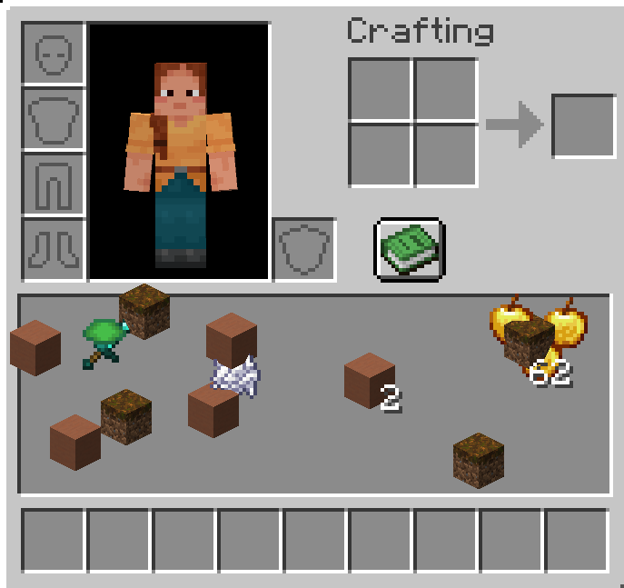

  
  
  # Gridless Inventory Mod
  *A Fabric mod that destroys Minecraft's classic boring boxes (slots) and brings total freedom to your inventory!*

---

## 🌟 About the Mod

**Gridless** completely removes the grid from the player inventory (and everywhere the player inventory is displayed, such as Chests, Furnaces). You no longer have to squeeze your items into 9x3 narrow boxes. You can place your items anywhere you want, in any layout you want, pixel by pixel according to your own taste!

### ✨ Features
- **Free Placement:** Grab your items and drop them anywhere in your inventory.
- **Premium Interactions:** When you hover over an item, it gently scales up and its name appears. There is no standard, ugly white square highlight.
- **Universal UI Support:** It works flawlessly not only in the normal inventory but also in Chests, Crafting Tables, Furnaces, and even the Survival tab of Creative Mode. It automatically adapts to all GUI sizes.
- **Smart Magnet System:** While holding an item on your cursor, **Double Click** on the same items on the ground to gather all identical items nearby into your hand (Max 64).
- **Classic Click Experience:** 
  - *Left Click:* Merges items with the stack on the ground.
  - *Right Click:* Splits half of the stack on the ground, or drops exactly 1 item from your hand onto the ground.
- **Auto-Merge:** Newly collected items from the world are stacked directly on top of scattered items in your inventory. If you don't have that item, it automatically goes to your Hotbar.
- **No Data Loss:** Even when you log out, the pixel coordinates of your items are saved to your character as NBT data, and are never lost.

## 📥 Installation

1. Make sure you have [Fabric Loader](https://fabricmc.net/use/installer/) installed (This mod is designed for 1.20.1).
2. Download the [Fabric API](https://modrinth.com/mod/fabric-api) mod and put it in your `.minecraft/mods` folder.
3. Download the `.jar` file of this mod (or get it from `build/libs`) and put it in your `.minecraft/mods` folder.
4. Launch the game and enjoy the freedom of your inventory!

## ⌨️ How to Use?
When you open your inventory in the game with `E` (or your inventory key), you will see that the slots are covered with a gray background and it is a single massive area. Now you can drop your items freely!

---
*Designed with 🤍 by Cukkoo12.*
